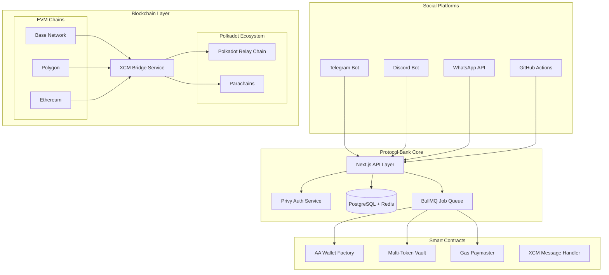
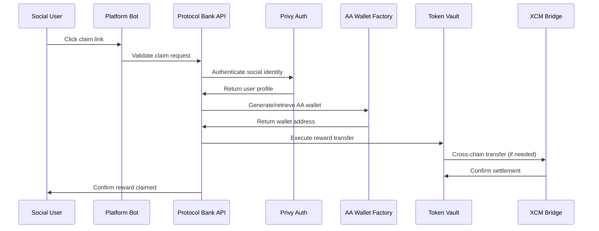
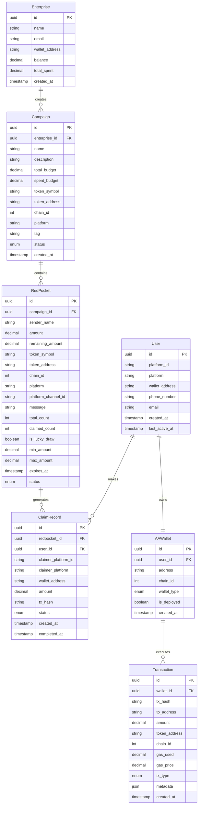

# Design Document

## Overview

Protocol Bank is a sophisticated cross-chain Web3 incentive distribution platform that leverages Account Abstraction (ERC-4337) and Cross-Consensus Message Format (XCM) to provide seamless reward distribution across social platforms. The system eliminates traditional Web3 friction by automatically generating smart wallets for users and sponsoring gas fees, while providing enterprises with comprehensive financial tracking and compliance tools.

The architecture follows a "centralized coordination, decentralized settlement" model where social platform interactions are coordinated through a unified backend, but all financial settlements occur on-chain through smart contracts with full transparency and auditability.

## Architecture

### High-Level System Architecture



### Component Interaction Flow



## Components and Interfaces

### 1. Social Platform Integration Layer

**Telegram Bot Service**
- **Interface**: Telegram Bot API v7.0
- **Authentication**: Bot token-based authentication
- **Features**: Inline keyboards, Web App integration, deep linking
- **Message Types**: Text messages, inline buttons, web app launches
- **Webhook Handling**: Secure webhook validation with secret tokens

**Discord Bot Service**
- **Interface**: Discord API v10 with slash commands
- **Authentication**: OAuth2 with bot permissions
- **Features**: Slash commands, embed messages, ephemeral responses
- **Interaction Types**: Application commands, message components, modals
- **Permission Model**: Guild-based permissions with role restrictions

**WhatsApp Business API**
- **Interface**: WhatsApp Business Platform API v18.0
- **Authentication**: System user access tokens with webhook verification
- **Features**: Template messages, interactive messages, media sharing
- **Message Flow**: Template-based outbound, free-form inbound responses
- **Compliance**: Opt-in requirements, 24-hour messaging window

**GitHub Integration**
- **Interface**: GitHub REST API v4 and GraphQL API v4
- **Authentication**: GitHub Apps with installation tokens
- **Features**: Issue/PR comments, GitHub Actions, repository webhooks
- **Event Types**: Issue comments, pull request events, repository activities
- **Security**: Webhook signature verification, scoped permissions

### 2. Account Abstraction Infrastructure

**ERC-4337 Implementation**
```typescript
interface AAWalletFactory {
  // Create deterministic wallet address before deployment
  predictWalletAddress(socialId: string, platform: string): Promise<string>
  
  // Deploy wallet contract when first transaction occurs
  deployWallet(socialId: string, platform: string): Promise<string>
  
  // Execute gasless transaction via bundler
  executeUserOperation(
    wallet: string,
    target: string,
    data: string,
    value: bigint
  ): Promise<string>
}

interface PaymasterService {
  // Sponsor gas fees for user operations
  sponsorUserOperation(userOp: UserOperation): Promise<UserOperation>
  
  // Validate sponsorship eligibility
  validateSponsorship(wallet: string, operation: string): Promise<boolean>
  
  // Track gas usage and costs
  trackGasUsage(txHash: string, gasUsed: bigint): Promise<void>
}
```

**Wallet Generation Strategy**
- **Deterministic Addresses**: Use CREATE2 with social platform ID as salt
- **Counterfactual Deployment**: Generate addresses before contract deployment
- **Lazy Deployment**: Deploy contracts only when first transaction occurs
- **Multi-Chain Support**: Same address across all supported EVM chains

### 3. Cross-Chain Bridge Architecture

**XCM Integration Service**
```typescript
interface XCMBridge {
  // Send cross-chain message via XCM
  sendXCMMessage(
    originChain: ChainId,
    destChain: ChainId,
    message: XCMMessage
  ): Promise<string>
  
  // Handle incoming XCM messages
  handleXCMMessage(message: XCMMessage): Promise<void>
  
  // Query cross-chain asset balances
  getAssetBalance(
    chain: ChainId,
    asset: AssetId,
    account: string
  ): Promise<bigint>
  
  // Execute cross-chain asset transfer
  transferAsset(
    fromChain: ChainId,
    toChain: ChainId,
    asset: AssetId,
    amount: bigint,
    recipient: string
  ): Promise<string>
}
```

**Supported Chain Matrix**
- **EVM Chains**: Base (primary), Polygon, Ethereum mainnet
- **Polkadot Ecosystem**: Polkadot relay chain, Acala, Moonbeam, Astar
- **Bridge Protocols**: XCM for Polkadot ecosystem, LayerZero for EVM chains
- **Asset Support**: USDC, USDT, DOT, native tokens on each chain

### 4. Enterprise Management System

**Campaign Management Interface**
```typescript
interface CampaignManager {
  // Create new reward campaign
  createCampaign(params: CampaignParams): Promise<Campaign>
  
  // Generate platform-specific distribution links
  generateDistributionLinks(
    campaignId: string,
    platforms: Platform[]
  ): Promise<DistributionLinks>
  
  // Track campaign performance metrics
  getCampaignMetrics(campaignId: string): Promise<CampaignMetrics>
  
  // Export financial reports
  exportFinancialReport(
    enterpriseId: string,
    dateRange: DateRange,
    format: 'CSV' | 'PDF'
  ): Promise<Buffer>
}
```

**Financial Tracking System**
- **Real-time Analytics**: Live dashboard with transaction flows
- **Automated Categorization**: Tag-based expense classification
- **Compliance Reporting**: Tax-compliant documentation with source links
- **Multi-signature Controls**: Enterprise wallet security with role-based access

## Data Models

### Core Entity Relationships



### Configuration Schema

```typescript
interface SystemConfig {
  // Blockchain configuration
  chains: {
    [chainId: number]: {
      name: string
      rpcUrl: string
      explorerUrl: string
      nativeToken: string
      supportedTokens: TokenConfig[]
      contracts: {
        walletFactory: string
        vault: string
        paymaster: string
      }
    }
  }
  
  // XCM configuration
  xcm: {
    polkadotEndpoint: string
    parachainEndpoints: { [paraId: number]: string }
    assetRegistry: { [assetId: string]: AssetConfig }
  }
  
  // Social platform configuration
  platforms: {
    telegram: {
      botToken: string
      webhookUrl: string
      allowedChats: string[]
    }
    discord: {
      clientId: string
      clientSecret: string
      botToken: string
      guildIds: string[]
    }
    whatsapp: {
      accessToken: string
      phoneNumberId: string
      webhookVerifyToken: string
    }
    github: {
      appId: string
      privateKey: string
      webhookSecret: string
    }
  }
}
```

## Correctness Properties

*A property is a characteristic or behavior that should hold true across all valid executions of a system—essentially, a formal statement about what the system should do. Properties serve as the bridge between human-readable specifications and machine-verifiable correctness guarantees.*

Now I need to analyze the acceptance criteria to determine which ones can be tested as properties.

### Property Reflection

After analyzing all acceptance criteria, I identified several areas where properties can be consolidated:

**Redundancy Analysis:**
- Properties 2.3, 6.3, and 8.3 all test gas sponsorship - can be combined into one comprehensive property
- Properties 3.2 and 8.4 both test cross-chain consistency - can be merged
- Properties 5.3 and 7.5 both test transaction traceability and audit logging - can be combined
- Properties 1.2 and 4.1-4.4 test platform-specific functionality - platform examples can be consolidated
- Properties 7.1 and 4.5 both test signature validation - can be merged into one security property

**Final Consolidated Properties:**

### Property 1: Multi-Platform Distribution Support
*For any* RedPocket campaign, the system should generate valid claim links for all four supported platforms (Telegram, Discord, WhatsApp, GitHub) with platform-appropriate formats
**Validates: Requirements 1.1, 1.2**

### Property 2: Mandatory Expense Categorization
*For any* reward distribution request without a tag, the system should reject the request and require proper categorization
**Validates: Requirements 1.3**

### Property 3: Lucky Draw Bounds Compliance
*For any* lucky draw RedPocket configuration, all generated reward amounts should fall within the specified minimum and maximum bounds
**Validates: Requirements 1.4**

### Property 4: Expired Fund Recovery
*For any* expired RedPocket with remaining funds, the system should automatically return unclaimed amounts to the enterprise wallet
**Validates: Requirements 1.5**

### Property 5: Deterministic Wallet Generation
*For any* social identity, the system should always generate the same AA wallet address using ERC-4337 standards
**Validates: Requirements 2.1, 2.2**

### Property 6: Comprehensive Gas Sponsorship
*For any* user operation (claims, withdrawals, transactions), the Paymaster should sponsor all gas fees, resulting in zero cost to users
**Validates: Requirements 2.3, 6.3, 8.3**

### Property 7: Counterfactual Address Support
*For any* social identity, the system should be able to compute valid wallet addresses before any on-chain deployment occurs
**Validates: Requirements 2.4**

### Property 8: Multi-Chain Distribution Support
*For any* reward distribution, the system should successfully operate on Base, Polygon, and Polkadot parachains
**Validates: Requirements 3.1**

### Property 9: Cross-Chain Consistency and Atomicity
*For any* cross-chain operation, the system should maintain state consistency across all chains and provide rollback mechanisms for failed operations
**Validates: Requirements 3.2, 3.4, 8.4**

### Property 10: Cost-Effective Chain Selection
*For any* transaction, the system should automatically select the chain with the lowest transaction cost among available options
**Validates: Requirements 3.3**

### Property 11: Automatic Chain Failover
*For any* detected chain congestion, the system should automatically route transactions to alternative chains with proper retry mechanisms
**Validates: Requirements 3.5, 9.5**

### Property 12: Secure Webhook Validation
*For any* incoming webhook from social platforms, the system should validate signatures and reject invalid or tampered requests
**Validates: Requirements 4.5, 7.1**

### Property 13: Real-Time Dashboard Accuracy
*For any* enterprise dashboard view, the displayed transaction data should accurately reflect real-time blockchain state with proper platform attribution
**Validates: Requirements 5.1**

### Property 14: Comprehensive Financial Reporting
*For any* generated financial report, the system should include all required tax-compliant fields with accurate calculations and real-time fiat valuations
**Validates: Requirements 5.2, 5.5**

### Property 15: Transaction Traceability and Audit Logging
*For any* transaction, the system should maintain immutable audit logs linking to source platform activities with comprehensive tracking
**Validates: Requirements 5.3, 7.5**

### Property 16: Multi-Signature Security
*For any* enterprise fund management operation, the system should require proper multi-signature authorization before execution
**Validates: Requirements 5.4, 7.3**

### Property 17: Reward Aggregation Accuracy
*For any* user accessing the portal, the system should correctly aggregate and display rewards from all connected social platforms
**Validates: Requirements 6.1**

### Property 18: Flexible Withdrawal Options
*For any* user withdrawal request, the system should support both Web3 wallet transfers and fiat off-ramp options
**Validates: Requirements 6.2**

### Property 19: Fund Preservation and Account Merging
*For any* user with unclaimed rewards or multiple social identities, the system should preserve funds and merge balances appropriately
**Validates: Requirements 6.4, 6.5**

### Property 20: Anti-Fraud Protection
*For any* suspicious activity or duplicate claim attempt, the system should implement rate limiting, account restrictions, and prevent double-claiming
**Validates: Requirements 7.2, 7.4**

### Property 21: Smart Contract Standards Compliance
*For any* deployed contract, the system should conform to ERC-4337 standards and support multi-token operations with batch processing
**Validates: Requirements 8.1, 8.2**

### Property 22: Seamless Contract Upgrades
*For any* contract upgrade, the system should use proxy patterns to maintain continuity without disrupting user operations or losing state
**Validates: Requirements 8.5**

### Property 23: Configuration Round-Trip Integrity
*For any* valid configuration object, parsing then serializing then parsing should produce an equivalent object
**Validates: Requirements 10.4**

### Property 24: Configuration Validation and Error Handling
*For any* configuration input, the parser should validate against schema and provide descriptive error messages for invalid configurations
**Validates: Requirements 10.1, 10.2**

### Property 25: Hot Configuration Reloading
*For any* configuration update, the system should apply changes without requiring system restarts or service interruption
**Validates: Requirements 10.5**

## Error Handling

### Blockchain Error Recovery
- **Transaction Failures**: Automatic retry with exponential backoff for temporary failures
- **Chain Congestion**: Automatic routing to alternative chains when primary chain is congested
- **Cross-Chain Failures**: Rollback mechanisms to maintain consistency across all chains
- **Gas Estimation Errors**: Fallback to conservative gas estimates with Paymaster sponsorship

### Social Platform Error Handling
- **Webhook Failures**: Retry mechanisms with dead letter queues for persistent failures
- **API Rate Limits**: Intelligent backoff and request queuing to respect platform limits
- **Authentication Errors**: Automatic token refresh and graceful degradation
- **Platform Downtime**: Graceful handling with user notifications and retry scheduling

### User Experience Error Recovery
- **Wallet Generation Failures**: Fallback to alternative wallet providers with user notification
- **Claim Processing Errors**: Clear error messages with suggested resolution steps
- **Network Connectivity Issues**: Offline capability with sync when connection restored
- **Invalid User Input**: Real-time validation with helpful correction suggestions

## Testing Strategy

### Dual Testing Approach

The system employs both unit testing and property-based testing for comprehensive coverage:

**Unit Tests** focus on:
- Specific platform integration examples (Telegram bot commands, Discord slash commands)
- Edge cases and error conditions (invalid signatures, malformed requests)
- Integration points between components (API to blockchain, webhook processing)
- Configuration parsing examples with known valid/invalid inputs

**Property-Based Tests** focus on:
- Universal properties that hold across all inputs (gas sponsorship, deterministic wallets)
- Cross-chain consistency and atomicity guarantees
- Security properties (signature validation, anti-fraud measures)
- Financial accuracy and audit trail integrity

### Property-Based Testing Configuration

**Testing Framework**: Fast-check for TypeScript/JavaScript components, Hypothesis for Python services
**Test Iterations**: Minimum 100 iterations per property test to ensure statistical confidence
**Test Tagging**: Each property test tagged with format: **Feature: cross-chain-redpocket-system, Property {number}: {property_text}**

**Example Property Test Structure**:
```typescript
// Feature: cross-chain-redpocket-system, Property 5: Deterministic wallet generation
test('deterministic wallet addresses', async () => {
  await fc.assert(fc.asyncProperty(
    fc.record({
      socialId: fc.string({ minLength: 1 }),
      platform: fc.constantFrom('telegram', 'discord', 'whatsapp', 'github')
    }),
    async ({ socialId, platform }) => {
      const address1 = await walletFactory.predictWalletAddress(socialId, platform)
      const address2 = await walletFactory.predictWalletAddress(socialId, platform)
      expect(address1).toBe(address2)
      expect(isValidAddress(address1)).toBe(true)
    }
  ), { numRuns: 100 })
})
```

### Integration Testing Strategy

**Cross-Chain Testing**: Automated tests against testnets for all supported chains
**Social Platform Testing**: Mock servers for platform APIs with realistic response patterns
**End-to-End Testing**: Complete user journeys from social platform interaction to fund withdrawal
**Performance Testing**: Load testing with simulated concurrent users across all platforms
**Security Testing**: Penetration testing for webhook endpoints and smart contract interactions

The testing strategy ensures that both specific examples work correctly (unit tests) and universal properties hold across all possible inputs (property tests), providing comprehensive validation of system correctness and reliability.